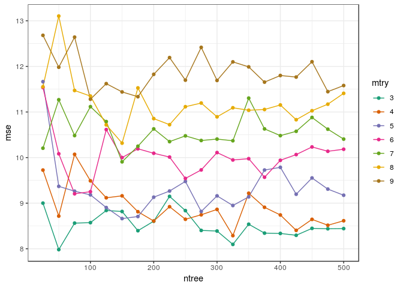
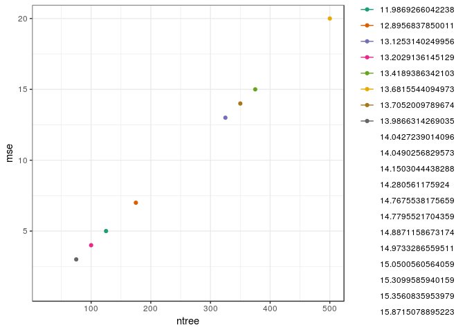
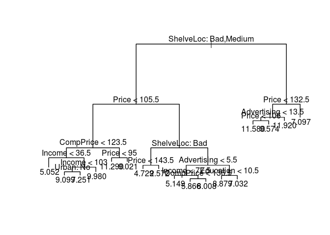
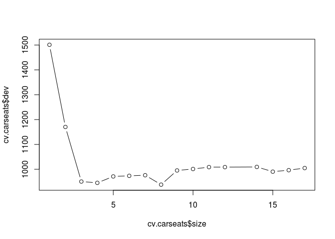
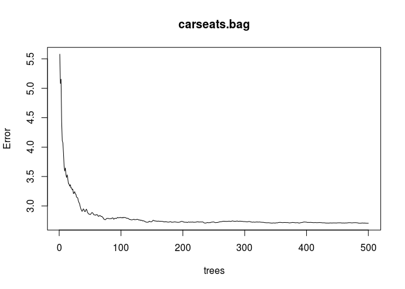
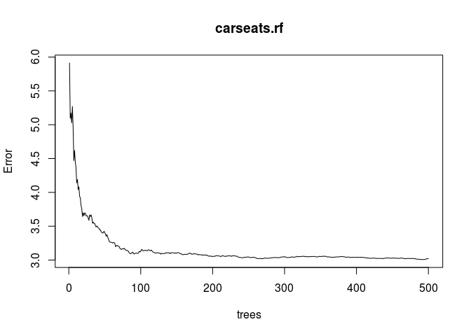
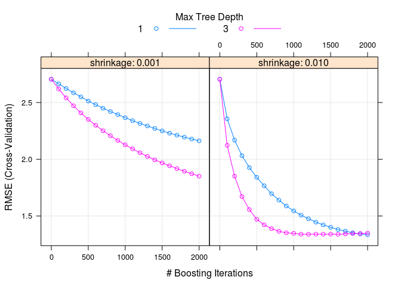
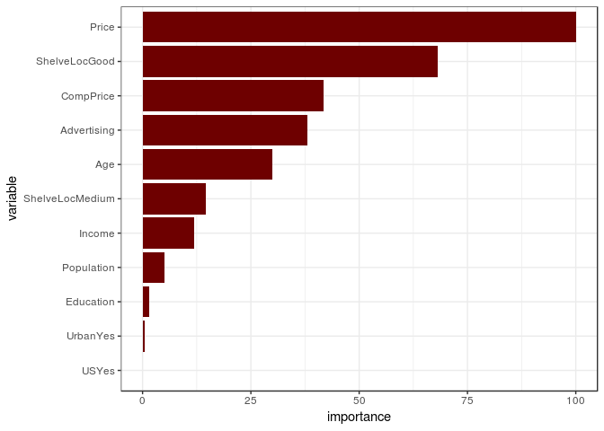

Homework 4: Bags, Forests, Boosts, oh my
================
David Cobb
3/9/2019

Problem 1

Problem 7 from Chapter 8 in the text. To be specific, please use a sequence of `ntree` from 25 to 500 in steps of 25 and `mtry` from 3 to 9 for by 1.

In the lab, we applied random forests to the Boston data using mtry=6 and using ntree=25 and ntree=500. Create a plot displaying the test error resulting from random forests on this data set for a more com- prehensive range of values for mtry and ntree. You can model your plot after Figure 8.10. Describe the results obtained.

Answer 1
--------

``` r
set.seed(1)
df <- tbl_df(Boston)
inTraining <- createDataPartition(df$medv, p = .75, list = F)
                                  training <- df[inTraining,]
                                  testing <- df[-inTraining,]
                                  
set.seed(2)
mtry <- c(3:9)
ntree <- seq(25,500, len = 20)
results <- tibble(mtry = rep(NA,140),
                  ntree = rep(NA, 140),
                  mse = rep(NA, 140))
for(i in 1:7){
  for(j in 1:20){
    rf_train <- randomForest(medv ~ .,
                              data = training,
                              mtry = mtry[i],
                              ntree = ntree[j])
mse <- mean((predict(rf_train, newdata = testing) - testing$medv)^2)
results[(i-1)*20 + j,] <- c(mtry[i], ntree[j], mse)
  }
  }
```

### Graph

``` r
p<- ggplot(data = results,
           aes(x = ntree, y = mse, col = as.factor(mtry)))
p + geom_line() +
  geom_point() +
  scale_color_brewer("mtry", palette = "Dark2")
```



``` r
library(doMC)
```

    ## Loading required package: iterators

``` r
registerDoMC(cores = 4)
set.seed(1982)
results <- tibble(ntree = ntree,
                  mtry_3 = 1:20,
                  mtry_4 = 1:20,
                  mtry_5 = 1:20,
                  mtry_6 = 1:20,
                  mtry_7 = 1:20,
                  mtry_8 = 1:20,
                  mtry_9 = 1:20,
                  mse = 1:20)
for(i in 1:20){
  cat(sprintf('ntree: %s --- %s\n', ntree[i],Sys.time()))
  rf_boston_cv <- train(medv ~ .,
                      data = training,
                      method = "rf",
                      ntree = ntree[i],
                      importance = T,
                      tuneGrid = data.frame(mtry = 3:9))
  results[i, 2:8] <- rf_boston_cv$results$RMSE^2
}
```

    ## ntree: 25 --- 2019-03-09 22:26:30
    ## ntree: 50 --- 2019-03-09 22:26:34
    ## ntree: 75 --- 2019-03-09 22:26:39
    ## ntree: 100 --- 2019-03-09 22:26:46
    ## ntree: 125 --- 2019-03-09 22:26:55
    ## ntree: 150 --- 2019-03-09 22:27:06
    ## ntree: 175 --- 2019-03-09 22:27:19
    ## ntree: 200 --- 2019-03-09 22:27:34
    ## ntree: 225 --- 2019-03-09 22:27:51
    ## ntree: 250 --- 2019-03-09 22:28:10
    ## ntree: 275 --- 2019-03-09 22:28:31
    ## ntree: 300 --- 2019-03-09 22:28:54
    ## ntree: 325 --- 2019-03-09 22:29:19
    ## ntree: 350 --- 2019-03-09 22:29:46
    ## ntree: 375 --- 2019-03-09 22:30:15
    ## ntree: 400 --- 2019-03-09 22:30:46
    ## ntree: 425 --- 2019-03-09 22:31:19
    ## ntree: 450 --- 2019-03-09 22:31:54
    ## ntree: 475 --- 2019-03-09 22:32:31
    ## ntree: 500 --- 2019-03-09 22:33:10

``` r
results
```

    ## # A tibble: 20 x 9
    ##    ntree mtry_3 mtry_4 mtry_5 mtry_6 mtry_7 mtry_8 mtry_9   mse
    ##    <dbl>  <dbl>  <dbl>  <dbl>  <dbl>  <dbl>  <dbl>  <dbl> <int>
    ##  1    25   14.2   13.1   13.1   12.2   12.6   12.8   12.4     1
    ##  2    50   14.0   13.3   13.0   13.2   12.8   13.0   13.1     2
    ##  3    75   14.0   13.1   12.8   12.7   12.8   13.0   13.1     3
    ##  4   100   13.2   12.5   12.4   12.2   12.3   12.1   12.3     4
    ##  5   125   12.0   11.2   11.1   10.9   10.9   11.0   11.2     5
    ##  6   150   14.8   13.9   13.4   13.1   13.1   13.1   13.0     6
    ##  7   175   12.9   12.3   12.1   12.1   12.2   12.3   12.3     7
    ##  8   200   14.9   14.0   13.6   13.4   13.4   13.1   13.2     8
    ##  9   225   15.3   14.2   13.8   13.5   13.2   13.1   13.0     9
    ## 10   250   15.4   14.5   14.2   13.9   13.9   13.9   13.9    10
    ## 11   275   15.1   14.3   13.8   13.4   13.6   13.6   13.7    11
    ## 12   300   14.0   13.2   12.9   12.7   12.5   12.5   12.6    12
    ## 13   325   13.1   12.5   12.1   11.9   11.9   11.9   11.9    13
    ## 14   350   13.7   13.0   12.6   12.5   12.4   12.4   12.4    14
    ## 15   375   13.4   12.5   12.1   12.0   11.9   12.0   12.0    15
    ## 16   400   15.9   15.2   14.8   14.6   14.5   14.6   14.6    16
    ## 17   425   14.8   14.1   13.8   13.5   13.4   13.4   13.3    17
    ## 18   450   14.3   13.4   13.1   12.9   12.8   12.9   13.0    18
    ## 19   475   15.0   14.2   13.8   13.7   13.6   13.5   13.5    19
    ## 20   500   13.7   12.8   12.5   12.2   12.1   11.9   12.0    20

Problem 2 \#\#\# Graph

``` r
#thing <- c(results$ntree,results$mtry_3,results$mtry_4,results$mtry_5,results$mtry_6,results$mtry_7,results$mtry_8,results$mtry_9,results$mse)
p <- ggplot(data = results,
           aes(x = ntree, y = mse, col= as.factor(mtry_3)))
p + geom_line() +
  geom_point() +
  scale_color_brewer("mtry_3", palette = "Dark2")
```

    ## Warning in RColorBrewer::brewer.pal(n, pal): n too large, allowed maximum for palette Dark2 is 8
    ## Returning the palette you asked for with that many colors

    ## Warning: Removed 12 rows containing missing values (geom_path).

    ## geom_path: Each group consists of only one observation. Do you need to
    ## adjust the group aesthetic?

    ## Warning: Removed 12 rows containing missing values (geom_point).



Problem 8 from Chapter 8 in the text. Set your seed with 9823 and split into train/test using 50% of your data in each split. In addition to parts (a) - (e), do the following:

1.  Fit a gradient-boosted tree to the training data and report the estimated test MSE.
2.  Fit a multiple regression model to the training data and report the estimated test MSE
3.  Summarize your results.

4.  In the lab, a classification tree was applied to the Carseats data set after converting Sales into a qualitative response variable. Now we will seek to predict Sales using regression trees and related approaches, treating the response as a quantitative variable. \# (a) Split the data set into a training set and a test set.

``` r
set.seed(9823)
df_Carseats <- tbl_df(Carseats)
inTraining <- createDataPartition(df_Carseats$Sales, p = .50, list = F)
                                  training <- df_Carseats[inTraining,]
                                  testing <- df_Carseats[-inTraining,]
```

``` r
# Part (a):
set.seed(9823)
n <- nrow(Carseats)
p <- ncol(Carseats) - 1  # remove the column we seek to predict i.e. Sales
train <- sample(1:n, n/2)
test <- (1:n)[-train]
```

### Part (b) Fit a regression tree to the training set. Plot the tree, and inter- pret the results. What test MSE do you obtain?

``` r
rtree.carseats <- tree(Sales ~ ., data = Carseats[train, ])
summary(rtree.carseats)
```

    ## 
    ## Regression tree:
    ## tree(formula = Sales ~ ., data = Carseats[train, ])
    ## Variables actually used in tree construction:
    ## [1] "ShelveLoc"   "Price"       "CompPrice"   "Income"      "Urban"      
    ## [6] "Advertising" "Education"  
    ## Number of terminal nodes:  17 
    ## Residual mean deviance:  2.083 = 381.1 / 183 
    ## Distribution of residuals:
    ##    Min. 1st Qu.  Median    Mean 3rd Qu.    Max. 
    ## -3.7810 -0.8101  0.0360  0.0000  0.7387  4.5230

``` r
plot(rtree.carseats)
text(rtree.carseats,pretty = 0)
```



### MSE

``` r
y_hat <- predict(rtree.carseats, newdata = Carseats[test, ])
test.MSE <- mean((y_hat - Carseats[test, ]$Sales)^2)
print(test.MSE)
```

    ## [1] 4.959247

The most important indicator of sales appears to be 6) Price &lt; 109.5 28 85.5800 12.190 \* followed by 15) Advertising &gt; 13.5 9 15.2700 11.920 \*. The Test MSE is 4.96.
=============================================================================================================================================================================

### Part (c): Use cross-validation in order to determine the optimal level of tree complexity. Does pruning the tree improve the test MSE?

``` r
cv.carseats <- cv.tree(rtree.carseats)
names(cv.carseats)
```

    ## [1] "size"   "dev"    "k"      "method"

``` r
print(cv.carseats)
```

    ## $size
    ##  [1] 17 16 15 14 12 11 10  9  8  7  6  5  4  3  2  1
    ## 
    ## $dev
    ##  [1] 1004.9235  996.3998  990.4206 1009.4352 1008.7079 1008.7079 1001.1219
    ##  [8]  995.2684  938.1942  976.1011  973.6675  971.2291  945.4478  950.6887
    ## [15] 1170.2822 1500.9047
    ## 
    ## $k
    ##  [1]      -Inf  16.19604  18.05913  18.91840  19.56858  19.63308  20.46107
    ##  [8]  21.17245  25.74982  52.83295  55.92608  57.35673  73.44701  97.94607
    ## [15] 245.01400 337.64026
    ## 
    ## $method
    ## [1] "deviance"
    ## 
    ## attr(,"class")
    ## [1] "prune"         "tree.sequence"

### plot the tree size

``` r
plot(cv.carseats$size, cv.carseats$dev, type = "b")  
```



### Pick the size of the tree you want to prune to: It looks like k=8 is the smallest tree with an error close to the minimum.

``` r
prune.carseats <- prune.tree(rtree.carseats, best = 8)

plot(prune.carseats)
text(prune.carseats, pretty = 0)
```



### Predict the MSE using this tree:

``` r
y_hat <- predict(prune.carseats, newdata = Carseats[test, ])
prune.MSE <- mean((y_hat - Carseats[test, ]$Sales)^2)
print(prune.MSE)
```

    ## [1] 5.427844

### Part (d): Use the bagging approach in order to analyze this data. What test MSE do you obtain? Use the importance() function to de- termine which variables are most important.

``` r
carseats.bag <- randomForest(Sales ~ ., data = Carseats, mtry = p, ntree = 500, importance = TRUE, subset = train)
y_hat <- predict(carseats.bag, newdata = Carseats[test, ])
mse.bag <- mean((Carseats[test, ]$Sales - y_hat)^2)
print(mse.bag)
```

    ## [1] 3.070469

``` r
plot(carseats.bag)
```


``` r
ibag <- importance(carseats.bag)
print(ibag[order(ibag[, 1]), ])
```

    ##                %IncMSE IncNodePurity
    ## Population  -0.7697326     57.649051
    ## Urban        1.1687302      8.867456
    ## Education    2.8224785     40.620529
    ## US           3.6948053      8.606905
    ## Age         10.0190133    105.183801
    ## Income      10.1092945     88.744497
    ## CompPrice   20.1313623    136.541449
    ## Advertising 21.3696744    157.546184
    ## ShelveLoc   53.5959158    398.022072
    ## Price       56.9192838    435.458106

### Part (e) Use random forests to analyze this data. What test MSE do you obtain? Use the importance() function to determine which vari- ables are most important. Describe the effect of m, the number of variables considered at each split, on the error rate obtained.

``` r
carseats.rf <- randomForest(Sales ~ ., data = Carseats, ntree = 500, mtry = p/3, importance = TRUE, subset = train)
y_hat <- predict(carseats.rf, newdata = Carseats[test, ])
mse.rf <- mean((Carseats[test, ]$Sales - y_hat)^2)
print(mse.rf)
```

    ## [1] 3.53684

``` r
plot(carseats.rf)
```



``` r
irf <- importance(carseats.rf)
print(irf[order(irf[, 1]), ])
```

    ##                 %IncMSE IncNodePurity
    ## Population  -0.92383513     104.58861
    ## Urban       -0.06851421      13.21907
    ## Education    0.79147863      51.68103
    ## US           2.54250310      20.77722
    ## Income       5.06266664     117.40845
    ## Age          9.07462256     137.91384
    ## CompPrice   12.05564087     123.16101
    ## Advertising 17.84332472     169.98603
    ## ShelveLoc   38.64399472     308.26756
    ## Price       39.01410528     351.91456

### 1. Fit a gradient-boosted tree to the training data and report the estimated test MSE.

``` r
set.seed(9823)
boost.Carseats=gbm(Sales~.,data=Carseats[train,],distribution="gaussian",n.trees=5000, interaction.depth=4)
yhat.boost=predict(boost.Carseats,newdata=Carseats[-train,], n.trees=5000)
mean((yhat.boost-Carseats[test, ]$Sales)^2)
```

    ## [1] 2.169447

### How about Gradient Boosting?

``` r
set.seed(9823)
grid <- expand.grid(interaction.depth = c(1, 3), 
                    n.trees = seq(0, 2000, by = 100),
                    shrinkage = c(.01, 0.001),
                    n.minobsinnode = 10)
trainControl <- trainControl(method = "cv", number = 5)
gbm_Carseats <- train(Sales ~.,
                    data = Carseats[train,], 
                    distribution = "gaussian", 
                    method = "gbm",
                    trControl = trainControl, 
                    tuneGrid = grid,
                    verbose = FALSE)
```

    ## Warning in nominalTrainWorkflow(x = x, y = y, wts = weights, info =
    ## trainInfo, : There were missing values in resampled performance measures.

``` r
gbm_Carseats
```

    ## Stochastic Gradient Boosting 
    ## 
    ## 200 samples
    ##  10 predictor
    ## 
    ## No pre-processing
    ## Resampling: Cross-Validated (5 fold) 
    ## Summary of sample sizes: 160, 160, 160, 160, 160 
    ## Resampling results across tuning parameters:
    ## 
    ##   shrinkage  interaction.depth  n.trees  RMSE      Rsquared   MAE     
    ##   0.001      1                     0     2.704981        NaN  2.237165
    ##   0.001      1                   100     2.663862  0.2840407  2.201393
    ##   0.001      1                   200     2.623293  0.3030511  2.165553
    ##   0.001      1                   300     2.585707  0.3287532  2.131952
    ##   0.001      1                   400     2.549209  0.3507542  2.100334
    ##   0.001      1                   500     2.512868  0.3755549  2.068770
    ##   0.001      1                   600     2.481114  0.3855423  2.041098
    ##   0.001      1                   700     2.449413  0.3945383  2.014021
    ##   0.001      1                   800     2.420556  0.4039178  1.988829
    ##   0.001      1                   900     2.393336  0.4124239  1.964719
    ##   0.001      1                  1000     2.366247  0.4226747  1.940066
    ##   0.001      1                  1100     2.339490  0.4336186  1.915712
    ##   0.001      1                  1200     2.315314  0.4426261  1.893199
    ##   0.001      1                  1300     2.293429  0.4496873  1.871938
    ##   0.001      1                  1400     2.271105  0.4567693  1.850909
    ##   0.001      1                  1500     2.249716  0.4627158  1.831910
    ##   0.001      1                  1600     2.229536  0.4681436  1.814976
    ##   0.001      1                  1700     2.212235  0.4722015  1.799698
    ##   0.001      1                  1800     2.194497  0.4760521  1.783438
    ##   0.001      1                  1900     2.178320  0.4812184  1.769523
    ##   0.001      1                  2000     2.162437  0.4863721  1.755358
    ##   0.001      3                     0     2.704981        NaN  2.237165
    ##   0.001      3                   100     2.619877  0.4563826  2.162441
    ##   0.001      3                   200     2.541309  0.4910294  2.095695
    ##   0.001      3                   300     2.471278  0.5032890  2.034762
    ##   0.001      3                   400     2.408536  0.5136094  1.980698
    ##   0.001      3                   500     2.350932  0.5241431  1.930017
    ##   0.001      3                   600     2.299269  0.5320527  1.883345
    ##   0.001      3                   700     2.251485  0.5419762  1.841228
    ##   0.001      3                   800     2.207299  0.5523404  1.802514
    ##   0.001      3                   900     2.165179  0.5624075  1.765897
    ##   0.001      3                  1000     2.127396  0.5709005  1.733372
    ##   0.001      3                  1100     2.092020  0.5775129  1.703036
    ##   0.001      3                  1200     2.057204  0.5868227  1.673926
    ##   0.001      3                  1300     2.024912  0.5954411  1.645733
    ##   0.001      3                  1400     1.994871  0.6042243  1.619799
    ##   0.001      3                  1500     1.967681  0.6099881  1.595878
    ##   0.001      3                  1600     1.942555  0.6154587  1.573247
    ##   0.001      3                  1700     1.917349  0.6220553  1.550664
    ##   0.001      3                  1800     1.894071  0.6280319  1.529280
    ##   0.001      3                  1900     1.872041  0.6335827  1.509174
    ##   0.001      3                  2000     1.850945  0.6384524  1.490188
    ##   0.010      1                     0     2.704981        NaN  2.237165
    ##   0.010      1                   100     2.356873  0.4242163  1.927543
    ##   0.010      1                   200     2.168533  0.4753274  1.759947
    ##   0.010      1                   300     2.031259  0.5324347  1.639508
    ##   0.010      1                   400     1.926774  0.5727310  1.544857
    ##   0.010      1                   500     1.840790  0.6086785  1.470667
    ##   0.010      1                   600     1.766171  0.6376036  1.412110
    ##   0.010      1                   700     1.696738  0.6641256  1.356420
    ##   0.010      1                   800     1.640296  0.6831617  1.311282
    ##   0.010      1                   900     1.588204  0.7002872  1.267698
    ##   0.010      1                  1000     1.544983  0.7117253  1.231577
    ##   0.010      1                  1100     1.507368  0.7209506  1.201420
    ##   0.010      1                  1200     1.475990  0.7283355  1.175976
    ##   0.010      1                  1300     1.445631  0.7360490  1.152758
    ##   0.010      1                  1400     1.422025  0.7410740  1.135779
    ##   0.010      1                  1500     1.400176  0.7460428  1.120000
    ##   0.010      1                  1600     1.380493  0.7503440  1.105186
    ##   0.010      1                  1700     1.366705  0.7538552  1.094006
    ##   0.010      1                  1800     1.351909  0.7576977  1.082324
    ##   0.010      1                  1900     1.341407  0.7601308  1.074895
    ##   0.010      1                  2000     1.334527  0.7612892  1.068876
    ##   0.010      3                     0     2.704981        NaN  2.237165
    ##   0.010      3                   100     2.123002  0.5669301  1.733233
    ##   0.010      3                   200     1.850919  0.6418513  1.497462
    ##   0.010      3                   300     1.671409  0.6887063  1.340114
    ##   0.010      3                   400     1.556548  0.7123549  1.254670
    ##   0.010      3                   500     1.470665  0.7325553  1.196623
    ##   0.010      3                   600     1.422087  0.7418434  1.160849
    ##   0.010      3                   700     1.388814  0.7482103  1.132033
    ##   0.010      3                   800     1.365309  0.7523001  1.109292
    ##   0.010      3                   900     1.352133  0.7543468  1.096037
    ##   0.010      3                  1000     1.347524  0.7542752  1.092286
    ##   0.010      3                  1100     1.339587  0.7556635  1.082249
    ##   0.010      3                  1200     1.339048  0.7546594  1.081106
    ##   0.010      3                  1300     1.339631  0.7535897  1.081229
    ##   0.010      3                  1400     1.339397  0.7528368  1.079252
    ##   0.010      3                  1500     1.339884  0.7519548  1.078373
    ##   0.010      3                  1600     1.338582  0.7517622  1.077108
    ##   0.010      3                  1700     1.341955  0.7501320  1.080382
    ##   0.010      3                  1800     1.344938  0.7485707  1.083551
    ##   0.010      3                  1900     1.345927  0.7478757  1.085238
    ##   0.010      3                  2000     1.349357  0.7464257  1.088270
    ## 
    ## Tuning parameter 'n.minobsinnode' was held constant at a value of 10
    ## RMSE was used to select the optimal model using the smallest value.
    ## The final values used for the model were n.trees = 2000,
    ##  interaction.depth = 1, shrinkage = 0.01 and n.minobsinnode = 10.

``` r
plot(gbm_Carseats)
```

 \`

``` r
imp <- varImp(gbm_Carseats)$importance
rn <- row.names(imp)
imp_df <- data_frame(variable = rn, 
                     importance = imp$Overall) %>%
  arrange(desc(-importance)) %>%
  mutate(variable = factor(variable, variable))
p <- ggplot(data = imp_df,
            aes(variable, importance))
p + geom_col(fill = "#6e0000") +
  coord_flip()
```



### What about test MSE for GB?

``` r
test_preds <- predict(gbm_Carseats, newdata= testing)
Carseats_test_df <- testing %>%
  mutate(y_hat_gbm = test_preds,
         sq_err_gbm = (y_hat_gbm - Sales)^2)
mean(Carseats_test_df$sq_err_gbm)
```

    ## [1] 1.506332

### 2. Fit a multiple regression model to the training data and report the estimated test MSE

``` r
lm.fit=lm(Sales~.,data=training)
summary(lm.fit)
```

    ## 
    ## Call:
    ## lm(formula = Sales ~ ., data = training)
    ## 
    ## Residuals:
    ##      Min       1Q   Median       3Q      Max 
    ## -2.73001 -0.74370  0.05735  0.70125  2.79990 
    ## 
    ## Coefficients:
    ##                   Estimate Std. Error t value Pr(>|t|)    
    ## (Intercept)      5.3719058  0.8813459   6.095 6.02e-09 ***
    ## CompPrice        0.0961630  0.0061210  15.710  < 2e-16 ***
    ## Income           0.0145521  0.0026568   5.477 1.36e-07 ***
    ## Advertising      0.1108655  0.0157793   7.026 3.74e-11 ***
    ## Population       0.0002349  0.0005417   0.434    0.665    
    ## Price           -0.0963392  0.0040825 -23.598  < 2e-16 ***
    ## ShelveLocGood    4.8395901  0.2283608  21.193  < 2e-16 ***
    ## ShelveLocMedium  1.9517284  0.1838631  10.615  < 2e-16 ***
    ## Age             -0.0450811  0.0048028  -9.386  < 2e-16 ***
    ## Education       -0.0198464  0.0292315  -0.679    0.498    
    ## UrbanYes         0.1770836  0.1634524   1.083    0.280    
    ## USYes           -0.2112815  0.2150752  -0.982    0.327    
    ## ---
    ## Signif. codes:  0 '***' 0.001 '**' 0.01 '*' 0.05 '.' 0.1 ' ' 1
    ## 
    ## Residual standard error: 1.049 on 189 degrees of freedom
    ## Multiple R-squared:  0.8608, Adjusted R-squared:  0.8527 
    ## F-statistic: 106.3 on 11 and 189 DF,  p-value: < 2.2e-16

``` r
test_preds <- predict(lm.fit, newdata = testing)
carseats_test_df <- testing %>%
  mutate(y_hat_rf_4 = test_preds,
         sq_err_rf_4 = (y_hat_rf_4 - Sales)^2)
mean(carseats_test_df$sq_err_rf_4)
```

    ## [1] 1.012709

``` r
## Test MSE
mean((testing$Sales - predict(lm.fit, newdata = testing))^2)
```

    ## [1] 1.012709

### 3. Summarize your results.
